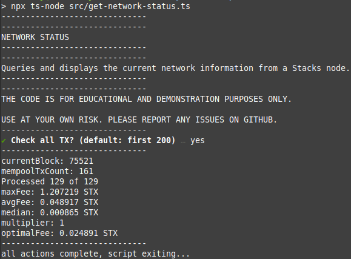
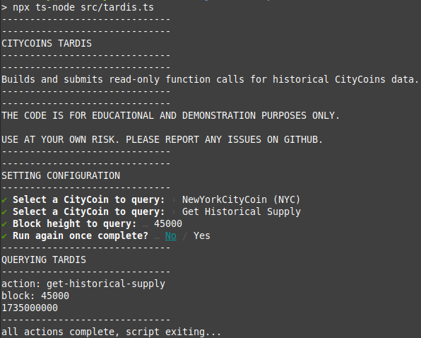

# CityCoins Scripts

This directory provides TypeScript examples of how to interact with the [Stacks blockchain](https://stacks.co) and [CityCoins protocol](https://citycoins.co).

All of the scripts use [prompts](https://github.com/terkelg/prompts) to gather the required information, and nothing is stored on disk.

For scripts that use a private key, remember to **keep it safe** and **never share with anyone**.

[This page has more information](./privatekey.md) on how to obtain your hex encoded private key for scripts that require it.

## Requirements

- [Node.js / NPM](https://nodejs.org/en/) (or [nvm](https://github.com/nvm-sh/nvm) for Mac/Linux)
- [TypeScript](https://www.npmjs.com/package/typescript)

## Installation

Clone this repository using either `ssh` or `https`:

```bash
git clone git@github.com:citycoins/scripts.git
OR
git clone https://github.com/citycoins/scripts.git
```

Enter the directory for the scripts and install the prerequisites:

```bash
cd scripts
npm install
```

## Usage

Any scripts can be run using the following command from the scripts directory:

```bash
npx ts-node src/scriptname.ts
```

## Supported Scripts

| Name                     | Description                                                                                                      |
| ------------------------ | ---------------------------------------------------------------------------------------------------------------- |
| claim-mining-reward.ts   | Claim mining rewards for a given address, can search multiple blocks.                                            |
| claim-stacking-reward.ts | Claim stacking rewards for a given address, can search multiple cycles.                                          |
| convert-to-v2.ts         | Convert V1 CityCoins to V2, [see here](https://www.citycoins.co/post/protocol-upgrade-faq) for more information. |
| get-network-status.ts    | Shows transaction statistics by reading the Stacks mempool.                                                      |
| mine-many.ts             | CityCoins miner script, can mine multiple blocks and set custom strategies.                                      |
| tardis.ts                | Obtain historical CityCoin data using on-chain CityCoin Tardis contracts.                                        |
| token-transfer.ts        | Step-by-step transfer tool to send CityCoins to another address.                                                 |

## Screenshots / Examples




